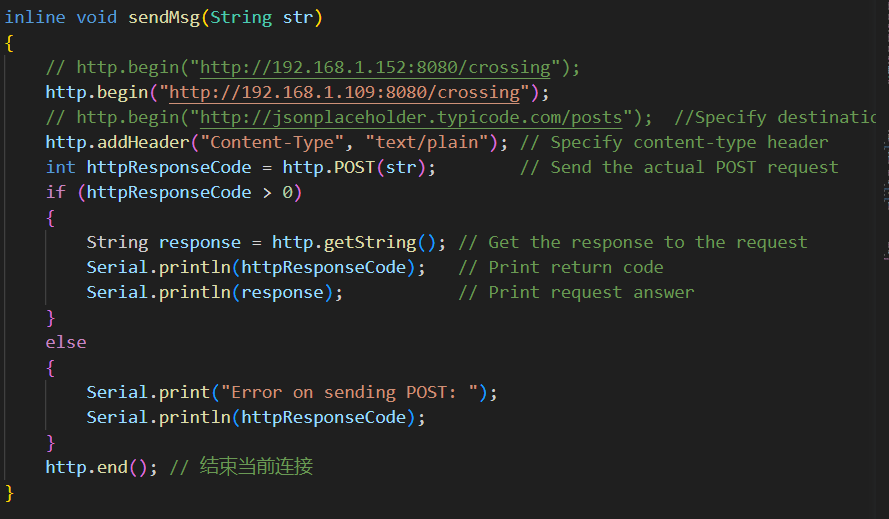
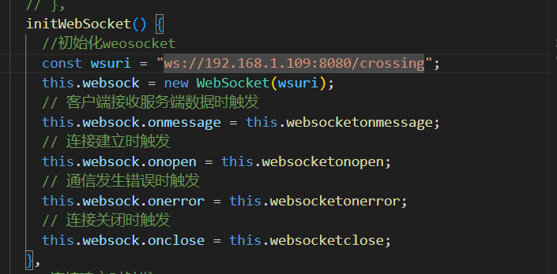

# 项目说明
该项目位车地道口协同系统源代码部分，具体代码结构如下

| 名称                     | 说明                   |
| ------------------------ | ---------------------- |
| CrossingClient           | 道口监控网页客户端代码 |
| CrossingInfoServer       | 云端服务器代码         |
| ESP32_WIFIModule         | esp32推送服务器代码    |
| RSUController            | 路侧单元代码           |
| TrainController          | 列车控制单元代码       |
| UpperComputer_Controller | 上位机代码             |
| VehicleController        | 车辆控制单元代码       |

# 整体工作流程
摄像头捕获当前路口信息，如栏杆状态，灯的状态，有无车辆等，将其封装发送给主控单元，主控单元对数据进一步解析，进而控制路口栏杆和灯动作，将当前道口信息封装发送给esp32,esp32拿到信息后将其在局域网内广播，电脑后端拦截到广播消息，进行解析，封装成json对象，主动发送给前端，前端页面对信息实时进行更新。（前后端通过websocket建立实时连接）

# 各部分代码阅读建议

## 道口监控网页客户端代码
该部分代码为vue项目，主要难点在于websocket的建立和通信，可参考[这篇文章](https://juejin.cn/post/6982078455722557448
)进行理解。其他的就只是简单的表格做一个双向的数据绑定。

## 云端服务器代码
该部分为springboot项目，主要分为2个部分来理解，首先是负责拦截局域网内的广播包，并将信息实时推送给前端服务器的websocket部分，其次就是负责将信息处理的部分，该部分也较为简单，其数据处理，进行封装，由Service层向上传递到Controller层，最后发送post请求到前端。

## esp32推送服务器代码
该部分主要做一个信息的转发，将主控单元发送给它的消息进行局域网内的广播。
该部分主要理解的点在于web配网部分代码，分为以下几个过程
- esp32板子以自身为ap点，建立一个wifi点
- 电脑主动与其进行连接，将当前可用wifi名称与密码发送给它
- 用拿到的信息进行连接，连接成功后其便和电脑处于同一个局域网内可以进行消息发送。

## 路侧单元代码

## 列车控制单元代码

## 上位机代码

## 车辆控制单元代码

# 调式注意事项
- 首先要进行`esp32`的配网，该部分需要将`ESP32_WIFIModule`中`src`文件夹下的`Message.h`中的`sendMsg()`函数中的`ip`地址替换为自己本机的`ip`地址，如下所示,需将`http.begin`中的`ip`替换。只需替换`ip`，端口无需替换。
查看本地`ip`方法为，打开电脑`cmd` 窗口，输入`ipconfig`指令即可找到。   

- 改动`ip`地址后，将整个项目重新进行编译，然后烧录到`esp32`开发板中进行配网。

- 打开前端项目`CrossingClient`将`src`文件夹下的`App.vue`中`initWebSocket方法中的`ip`地址替换为自己本地的`ip`地址，方法同上。如下所示

  